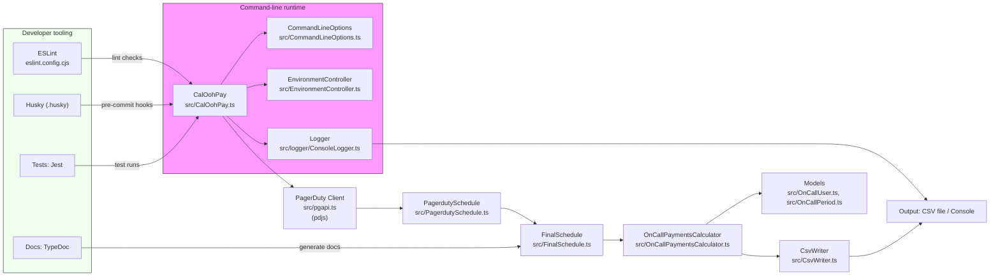

# Contributing to CalOohPay

Thank you for considering contributing to CalOohPay! This document explains how to set up a development environment, run tests and linters, write good commit messages, and open a clear pull request.

## Table of contents

- Getting started
- Development workflow
- Running tests and lint
- Docs (TypeDoc)
- Commit messages and PR checklist
- Branching and release notes
- Reporting issues
- Code of Conduct

## Getting started

1. Fork the repository and clone your fork:

```bash
git clone https://github.com/<your-username>/caloohpay.git
cd caloohpay
npm install
```

2. Build the project once to generate type artifacts and ensure the environment is sane:

```bash
npm run build
```

3. Link the CLI locally (optional):

```bash
npm link
```

## Development workflow

- Create a feature branch from `main` or `develop` (we prefer short-lived feature branches):
  - `git checkout -b feat/short-description`
- Follow the Conventional Commits format for commit messages (see below).
- Run tests and lint locally before opening a PR.
- Open a pull request with a clear description and link to any related issues.

### Branch naming

- feature: `feat/<short-name>`
- bugfix: `fix/<short-name>`
- refactor: `refactor/<short-name>`
- docs: `docs/<short-name>`
- chore: `chore/<short-name>`

## Running tests and lint

We aim to keep the test and linting feedback fast and useful.

- Run all tests:

```bash
npm test
```

- Run linter (static checks):

```bash
npm run lint
```

Configuration note: ESLint uses a flat config file `eslint.config.cjs` (ESLint v9). If you need to change or add rules, edit `eslint.config.cjs`. Flat configs differ from legacy `.eslintrc` files (they are an array of config objects). For advanced or type-aware rules you may need to enable them in CI or adjust `parserOptions.project`.

Husky note: You may see a deprecation warning when committing about sourcing `_/husky.sh` in `.husky/pre-commit`. That message advises removing the two lines that source husky helper scripts prior to Husky v10; update `.husky/pre-commit` when upgrading Husky to v10 to avoid breakage.

- Auto-fix lintable issues (imports, formatting, unused imports):

```bash
npm run lint:fix
```

- Type-check only:

```bash
npm run typecheck
```

Pre-commit and pre-push hooks are configured to help enforce these rules. If you need to skip them temporarily you can use `--no-verify`, but avoid doing this for regular PRs.

Husky & Git hooks
-----------------

This repository uses Husky to manage Git hooks. The project uses the `husky install` flow (run automatically on install via the `prepare` script). To ensure hooks are available locally after cloning:

```bash
# Install dependencies
npm install

# Install Husky hooks (also run automatically by `npm install` because of the `prepare` script)
npm run prepare
```

If you need to re-install or update hooks manually, run `npx husky install` or `npm run prepare`.

Note: The repo currently depends on Husky v9 but the pre-commit hook is written to remain compatible with future Husky v10 changes. If you upgrade Husky, make sure to run `npm run prepare` again and verify hooks.

## Docs (TypeDoc)

API documentation is generated with TypeDoc. All public exports should have JSDoc/TypeDoc comments to make the generated docs useful.

- Generate docs locally:

```bash
npm run docs
```

- Watch docs while editing:

```bash
npm run docs:watch
```

- Serve generated docs:

```bash
npm run docs:serve
```

### TypeDoc authoring guidelines

- Use `/** ... */` JSDoc comments on exported functions, classes and interfaces.
- Include `@param`, `@returns`, and short `@example` blocks when helpful.
- Keep `@since` and `@remarks` up-to-date when making public API changes.

If you change an exported API, update the docs and run `npm run docs` to validate the generated output.

Import rule note
----------------

We enforce an ESLint rule that forbids importing directly from `src/` paths in source files (e.g. `import x from 'src/Whatever'`). This keeps module boundaries clear and avoids brittle absolute-style imports.

How to import local modules correctly:

- From other `src` files: use relative imports (e.g. `import { Foo } from './Foo'` or `import { Bar } from '../utils/Bar'`).
- From tests: imports from `../src/...` are allowed (tests often reference source files directly). If you prefer, open an issue and we can standardize on a different pattern.

If ESLint flags `no-restricted-imports` for a `src/` import, change it to a relative import or import from the package entry (`import { Foo } from '.'`) where appropriate.

## Architecture diagram

A high-level overview of the CalOohPay CLI components and developer tooling (generated with Mermaid):



## Commit messages and PR checklist

We follow Conventional Commits. This makes changelog and release automation easier.

Examples:

```
feat: add timezone override flag to CLI
fix: avoid race condition when writing CSV
docs: update CONTRIBUTING.md
```

PR checklist before requesting review:

- [ ] Code builds: `npm run build` passes
- [ ] Tests: `npm test` passes
- [ ] Lint: `npm run lint` passes (or `npm run lint:fix` was run)
- [ ] Documented: public APIs have TypeDoc comments and docs regenerated if needed
- [ ] Commit messages match Conventional Commits

## Branch protection and releases

- Push to branches on your fork and open a PR to `main` (or `develop` if used).
- The repo is configured with Husky hooks to run typecheck/lint/test during commit/push. CI runs the same checks (`npm run typecheck`, `npm run lint`, `npm test`) plus `npm run build`.

## Reporting issues

When opening an issue please include:

- A clear title and summary
- Steps to reproduce (commands, environment)
- Expected vs actual behavior
- Any relevant logs or stack traces

## Code of Conduct

This project follows the [Contributor Covenant Code of Conduct](CODE_OF_CONDUCT.md). By participating in this project you agree to abide by its terms.

---

Thanks for contributing — we appreciate your time and effort! If anything in this document is unclear, open an issue or a PR to improve it.
